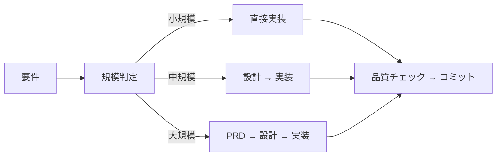

# AI コーディングプロジェクト ボイラープレート（Python版）

[](https://www.python.org/)
[](https://github.com/astral-sh/uv)
[](https://claude.ai/code)
[](https://opensource.org/licenses/MIT)

**このボイラープレートは以下のような開発者のためのツールです**
- AIを活用して**プロダクション品質のPythonプロジェクト**を開発したい
- 長時間のAIコーディングで起きる**コンテキスト枯渇**を回避したい
- **専門AIエージェント**で開発のワークフローを標準化したい

## 目次
1. [クイックスタート](#クイックスタート)
2. [なぜサブエージェント？](#なぜサブエージェント)
3. [スキルシステム](#スキルシステム)
4. [スラッシュコマンド](#スラッシュコマンド)
5. [開発ワークフロー](#claude-code-ワークフロー)
6. [プロジェクト構成](#プロジェクト構成)
7. [開発コマンド](#開発コマンド)

## クイックスタート

```bash
# 1. リポジトリをクローン
git clone <repository-url> my-project
cd my-project

# 2. 依存関係インストール
uv sync --dev

# 3. pre-commitフックをセットアップ
uv run pre-commit install

# 4. Claude Codeを起動して設定
claude                         # Claude Codeを起動
/project-inject                # プロジェクトコンテキストを設定
/implement <あなたの作りたい機能> # 開発開始！
```

詳細なセットアップ手順は[クイックスタートガイド](docs/guides/quickstart.md)を参照してください。

## なぜサブエージェント？

**従来のAIコーディングの問題**
- 長時間のセッションでコンテキストを失う
- 時間とともにコード品質が低下
- 大規模タスクで頻繁なセッション再起動が必要

**サブエージェントによる解決**
- 専門的な単一の役割に分割（設計、実装、レビュー）
- コンテキストを常に新鮮に保ち、品質を一定に維持
- 品質低下なしで規模感のあるタスクを処理

各サブエージェントは1つのタスクに集中します。その結果、コンテキストは枯渇せず、品質も維持されます。

[サブエージェントについて詳しく（Anthropic docs）](https://docs.anthropic.com/en/docs/claude-code/sub-agents)

## スキルシステム

自律的（Agentic）な実装ワークフローで用いられている原理原則を、日常のタスクにおいても必要に応じて参照できるようスキルとして提供しています。

### 適用されるスキル

| スキル | 目的 |
|--------|------|
| `coding-standards` | 汎用コーディング原則、アンチパターン、デバッグ |
| `python-rules` | Python型安全性、非同期パターン、リファクタリング |
| `python-testing` | pytest、TDD、カバレッジ要件 |
| `documentation-criteria` | PRD、ADR、Design Doc基準 |
| `technical-spec` | アーキテクチャ、環境設定、ビルドコマンド |
| `implementation-approach` | 戦略パターン、タスク分解 |
| `integration-e2e-testing` | 統合/E2Eテスト設計、ROIベース選択 |
| `project-context` | プロジェクト固有の設定（カスタマイズ可能） |

**フロントエンド専用スキル**も`frontend/`配下で利用可能（例：`frontend/python-rules` - FastAPI + HTMX/Jinja2向け）。

[スキルの仕組みについて（Claude Code docs）](https://code.claude.com/docs/ja/skills)

## スラッシュコマンド

Claude Codeで利用できる主要なコマンド：

| コマンド | 目的 | 使用場面 |
|---------|------|----------|
| `/implement` | 要件から実装までの一貫した開発 | 新機能開発（Backend） |
| `/task` | ルールに基づいた単一タスクの実行 | バグ修正、小規模な変更 |
| `/design` | 設計書の作成 | アーキテクチャの計画時（Backend） |
| `/plan` | 設計書から作業計画書を作成 | 設計承認後（Backend） |
| `/build` | 既存の計画から実行 | 作業の再開時（Backend） |
| `/review` | コードの準拠性確認 | 実装完了後 |
| `/front-design` | フロントエンド設計書の作成 | FastAPI + HTMX設計時 |
| `/front-plan` | フロントエンド作業計画書を作成 | フロントエンド設計承認後 |
| `/front-build` | フロントエンド実装の実行 | Webアプリケーション開発 |
| `/diagnose` | 根本原因分析ワークフロー | デバッグ、トラブルシューティング |
| `/reverse-engineer` | コードからPRD/Design Docを生成 | 既存システムのドキュメント化 |

[コマンドの詳細はこちら →](docs/guides/use-cases.md)

## Claude Code ワークフロー



### 動作の仕組み

1. **要件分析**: `/implement`コマンドがタスクの規模を判断します
2. **ドキュメント生成**: 必要に応じてドキュメント（PRD、Design Doc、Work Plan）を作成します
3. **タスク実行**: 専門のエージェントが各フェーズを担当します
4. **品質保証**: テスト、型チェック、必要に応じた修正を行います
5. **コミット**: タスクごとに整理されたコミットを作成します

## プロジェクト構成

```
ai-coding-project-boilerplate/
├── .claude/               # AIエージェント設定
│   ├── agents/           # 専門サブエージェント定義
│   ├── commands/         # スラッシュコマンド定義
│   └── skills/           # 自動コンテキスト読み込み用スキル
│       ├── coding-standards/
│       ├── python-rules/
│       ├── python-testing/
│       ├── documentation-criteria/
│       ├── technical-spec/
│       ├── project-context/
│       └── frontend/     # フロントエンド専用スキル
├── docs/
│   ├── guides/           # ユーザードキュメント
│   ├── adr/              # アーキテクチャ決定
│   ├── design/           # 設計ドキュメント
│   └── prd/              # 製品要件
├── src/                  # ソースコード
├── tests/                # テストコード
├── pyproject.toml        # プロジェクト設定
└── CLAUDE.md             # Claude Code設定
```

## 開発コマンド

| コマンド | 説明 |
|---------|------|
| `uv run python src/main.py` | アプリケーション実行 |
| `uv run pytest` | テスト実行 |
| `uv run pytest --cov=src` | カバレッジ測定 |
| `uv run ruff check src` | リントチェック |
| `uv run ruff format src` | フォーマット |
| `uv run pre-commit run --all-files` | 全ファイルにpre-commitを実行 |

## サブエージェント一覧

| エージェント | 担当領域 | 使用されるタイミング |
|------------|---------|------------------|
| **requirement-analyzer** | タスク規模の判定 | `/implement`コマンド実行時 |
| **technical-designer** | 設計ドキュメントの作成 | 中規模・大規模機能の開発時 |
| **document-reviewer** | ドキュメント品質チェック | ドキュメント作成後 |
| **design-sync** | Design Doc間の整合性検証 | Design Doc作成後 |
| **acceptance-test-generator** | ACからテストスケルトン生成 | 設計承認後 |
| **work-planner** | タスクの分解と計画 | 設計完了後 |
| **task-executor** | 実装作業 | 開発フェーズ |
| **quality-fixer** | 品質問題の修正 | エラーや警告の検出時 |
| **code-reviewer** | コードレビュー | `/review`コマンド実行時 |
| **integration-test-reviewer** | テスト実装品質の検証 | テスト実装後 |
| **investigator** | 問題調査 | `/diagnose` ステップ1 |
| **verifier** | 調査結果の検証 | `/diagnose` ステップ3 |
| **solver** | 解決策の導出 | `/diagnose` ステップ4 |

[エージェントの詳細 →](.claude/agents/)

## ライセンス

MIT License - 自由に使用・改変・配布可能

## このプロジェクトについて

AI Coding Project Boilerplate（Python版）は、AIを活用した開発において、コード品質と開発効率のバランスを重視して設計されています。サブエージェントによる役割分担とコンテキスト管理により、Pythonプロジェクトの効率的な開発をサポートします。
