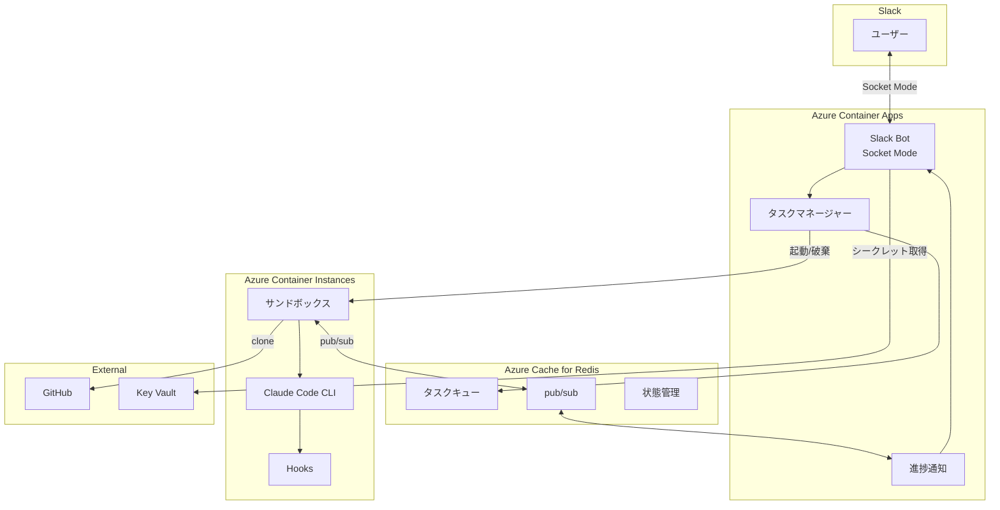
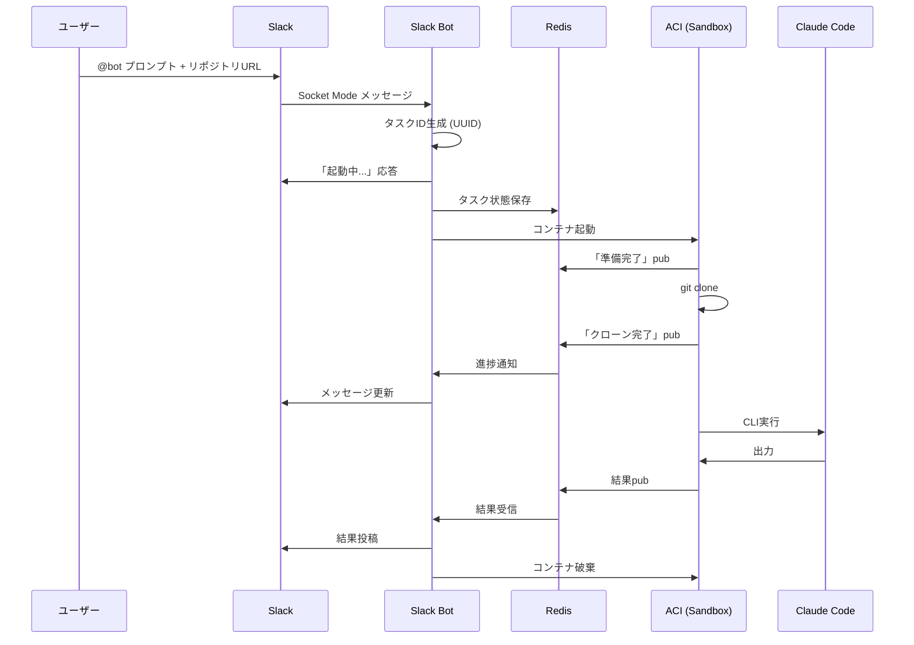
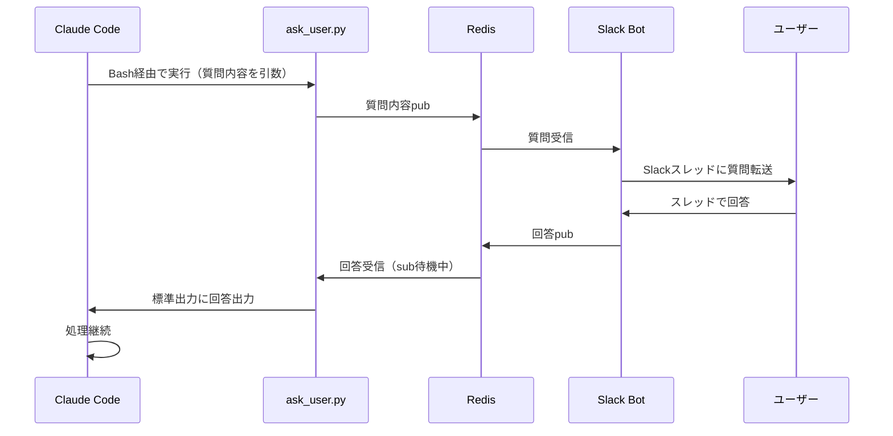
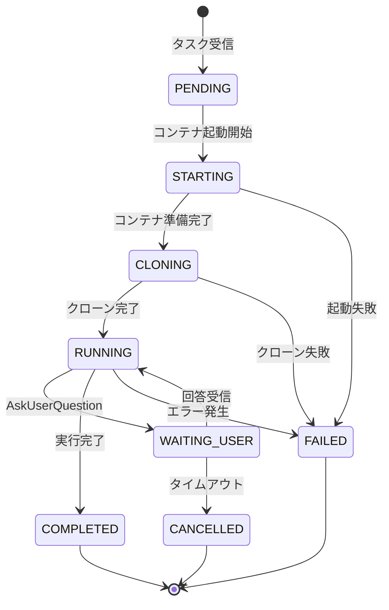

# Claude Code Sandbox Bot 設計書

## 概要

Slack経由でクラウド上のClaude Codeサンドボックス環境を操作し、GitHubリポジトリのコードベース調査やMCPタスクを実行するBot。ユーザーはSlackチャンネルからボットをメンションするだけで、クラウド上の隔離されたサンドボックスでClaude Codeを起動し、リポジトリを調査した結果をSlackに返信する。

## 設計サマリー（メタ）

```yaml
design_type: "新機能"
risk_level: "中"
main_constraints:
  - "ACI起動時間30秒〜1分の許容"
  - "ステートレス設計（毎回クリーンな状態）"
  - "個人開発（PoC検証段階）"
biggest_risks:
  - "ACI起動遅延によるUX劣化"
  - "Redis pub/subのメッセージ到達保証（fire-and-forget特性）"
unknowns:
  - "ask_user.pyスクリプトの応答待機中のタイムアウト挙動"
  - "大規模リポジトリのクローン時間"
```

## 背景と経緯

### 前提となるADR

- 本プロジェクトは新規開発のため、前提となるADRは存在しない
- 技術選定は要件定義時に確定済み（Azure分離構成、Socket Mode等）

### 合意事項チェックリスト

#### スコープ
- [x] Slack Bot（メンション/コマンドでリクエスト受信）
- [x] サンドボックス起動（リクエストごとにACIコンテナを起動・破棄）
- [x] GitHub連携（指定リポジトリをクローン）
- [x] Claude Code実行（CLI実行）
- [x] 進捗通知（Slackスレッドでリアルタイム進捗更新）
- [x] Human-in-the-loop（AskUserQuestion→Slack転送→回答リダイレクト）
- [x] 結果返却（短文は直接投稿、長文はファイル添付）
- [x] 並列実行制御（同時実行数を環境変数で制限）

#### スコープ外（明示的に変更しないもの）
- [x] MCP統合（Phase 2以降）
- [x] 認可制御（Workspace全員利用可）
- [x] リポジトリキャッシュ（都度クローン）
- [x] 永続的なデータ保存（Redis揮発性OK）

#### 制約
- [x] 並行運用: しない（新規開発）
- [x] 後方互換性: 不要（新規開発）
- [x] パフォーマンス計測: 必要（ACI起動時間のモニタリング）

### 解決すべき課題

Slackから直接Claude Codeを呼び出し、組織のGitHubリポジトリに対するコードベース調査を実行できる環境がない。現状では開発者が個人のローカル環境でClaude Codeを実行する必要があり、チーム全体での知識共有や非開発者からのアクセスが困難。

### 現状の課題

1. Claude Codeをチームで共有する仕組みがない
2. コードベース調査の結果をSlackで即座に共有できない
3. 非技術者がClaude Codeの恩恵を受けられない
4. セキュリティを考慮した隔離環境での実行が必要

### 要件

#### 機能要件

| ID | 要件 | 優先度 |
|----|------|--------|
| FR-01 | Slack Bot：メンション/コマンドでリクエスト受信 | Must |
| FR-02 | サンドボックス起動：リクエストごとにACIコンテナを起動・破棄 | Must |
| FR-03 | GitHub連携：指定リポジトリをクローン | Must |
| FR-04 | Claude Code実行：CLI実行 | Must |
| FR-05 | 進捗通知：Slackスレッドでリアルタイム進捗更新 | Should |
| FR-06 | Human-in-the-loop：AskUserQuestion→Slack転送→回答リダイレクト | Should |
| FR-07 | 結果返却：短文は直接投稿、長文はファイル添付 | Must |
| FR-09 | 並列実行制御：同時実行数を環境変数で制限 | Should |

#### 非機能要件

- **応答性**: リクエスト受信後1秒以内に「起動中...」応答
- **信頼性**: 冪等性のある設計（リトライ可能）
- **セキュリティ**: シークレットはKey Vault、ログ出力禁止
- **スケーラビリティ**: 同時実行数制限、超過時キューイング

## 受入条件（AC）- EARS形式

### FR-01: Slack Bot メンション/コマンド受信

- [x] **When** ユーザーがボットをメンションしてプロンプトを送信すると、システムはリクエストを受信しタスクIDを生成する
  - **Property**: `taskId.matches(/^[0-9a-f]{8}-[0-9a-f]{4}-4[0-9a-f]{3}-[89ab][0-9a-f]{3}-[0-9a-f]{12}$/)`
- [x] **When** ユーザーがスラッシュコマンド `/claude` を実行すると、システムは同様にリクエストを受信する
- [x] **If** リクエストにGitHubリポジトリURLが含まれていない場合、**then** システムはエラーメッセージ「リポジトリURLを指定してください」を返す

### FR-02: サンドボックス起動

- [x] **When** タスクが受信されると、システムは1秒以内に「起動中...」メッセージを投稿する
  - **Property**: `responseTime < 1000ms`
- [x] **When** タスクが受信されると、システムはACIコンテナを新規起動する
- [x] **When** タスクが完了または失敗すると、システムはACIコンテナを即座に破棄する
- [x] システムは各タスクに冪等性キー（UUID）を付与し、重複実行を防止する

### FR-03: GitHub連携

- [x] **When** サンドボックスが起動すると、システムは指定されたリポジトリを `git clone` する
- [x] **If** 認証が必要なプライベートリポジトリの場合、**then** システムはPersonal Access Tokenを使用してクローンを実行する
- [x] **If** クローンに失敗した場合、**then** システムはエラー詳細をSlackスレッドに投稿する

### FR-04: Claude Code実行

- [x] **When** リポジトリのクローンが完了すると、システムは `claude --dangerously-skip-permissions` でClaude Code CLIを起動する
- [x] **While** Claude Codeが実行中の間、システムはプロセスの標準出力を監視する

### FR-05: 進捗通知

- [x] **While** タスクが実行中の間、システムは進捗をSlackスレッドのメッセージとして更新する（メッセージ編集方式）
- [x] システムは進捗メッセージに現在のステータス（起動中/クローン中/実行中/完了）を含める

### FR-06: Human-in-the-loop

- [x] **When** Claude Codeがask_user.pyスクリプトを実行すると、システムは質問内容をSlackスレッドに転送する
- [x] **When** ユーザーがスレッドで回答すると、システムはRedis経由でスクリプトに回答を返し、標準出力でClaude Codeに渡す
- [x] **If** 回答がタイムアウト（10分）を超えた場合、**then** システムはタスクを中断しユーザーに通知する
  - **Property**: `timeout === 600000ms`

### FR-07: 結果返却

- [x] **When** Claude Codeの実行が完了すると、システムは結果をSlackに投稿する
- [x] **If** 結果が4000文字以下の場合、**then** システムはSlackに直接テキストとして投稿する
  - **Property**: `result.length <= 4000`
- [x] **If** 結果が4000文字を超える場合、**then** システムはテキストファイルとしてSlackにアップロードする

### FR-09: 並列実行制御

- [x] システムは同時実行数を環境変数 `MAX_CONCURRENT_TASKS` で制限する（デフォルト: 3）
  - **Property**: `concurrentTasks <= MAX_CONCURRENT_TASKS`
- [x] **If** 同時実行数が上限に達している場合、**then** システムは新規タスクをキューに追加し「待機中...」を通知する

## 既存コードベース分析

### 実装パスマッピング

| 種別 | パス | 説明 |
|-----|-----|-----|
| 既存 | src/main.py | ボイラープレート（実装なし） |
| 新規 | src/slack/ | Slack Bot関連モジュール |
| 新規 | src/sandbox/ | サンドボックス管理モジュール |
| 新規 | src/task/ | タスク管理モジュール |
| 新規 | src/redis/ | Redis接続・pub/subモジュール |
| 新規 | src/config/ | 設定管理モジュール |

### 統合ポイント（新規実装でも記載）

- **Slack API**: slack-bolt (Python) を使用してSocket Mode接続
- **Azure ACI**: azure-mgmt-containerinstance SDKでコンテナ管理
- **Redis**: redis-py (async) でpub/sub通信
- **GitHub**: git CLIコマンドでクローン

## 設計

### 変更影響マップ

```yaml
変更対象: 新規プロジェクト全体
直接影響:
  - src/main.py（エントリーポイント変更）
  - pyproject.toml（依存関係追加）
間接影響:
  - .env（環境変数設定追加）
  - Dockerfile（コンテナイメージ作成）
波及なし:
  - .claude/（開発支援設定は影響なし）
```

### アーキテクチャ概要

本システムは分離構成を採用し、Slack Bot（常駐プロセス）とサンドボックス（使い捨てコンテナ）を明確に分離する。



### データフロー



### Human-in-the-loop シーケンス



### 統合ポイント一覧

| 統合ポイント | 箇所 | 旧実装 | 新実装 | 切替方式 |
|------------|-----|-------|-------|---------|
| Slack接続 | src/slack/app.py | なし | Socket Mode (slack-bolt) | - |
| ACI管理 | src/sandbox/aci.py | なし | azure-mgmt-containerinstance | - |
| Redis通信 | src/redis/client.py | なし | redis-py async | - |
| 進捗通知 | src/task/progress.py | なし | Redis pub/sub + Slack API | - |
| シークレット | src/config/secrets.py | なし | Azure Key Vault | - |

### 主要コンポーネント

#### SlackBot (src/slack/)

- **責務**: Slackとの通信、メッセージ受信/送信、Socket Mode維持
- **インターフェース**:
  ```python
  class SlackBot(Protocol):
      async def start(self) -> None: ...
      async def send_message(self, channel: str, text: str, thread_ts: str | None = None) -> str: ...
      async def update_message(self, channel: str, ts: str, text: str) -> None: ...
      async def upload_file(self, channel: str, content: str, filename: str, thread_ts: str | None = None) -> None: ...
  ```
- **依存関係**: slack-bolt, slack-sdk

#### TaskManager (src/task/)

- **責務**: タスクのライフサイクル管理、キューイング、並列実行制御
- **インターフェース**:
  ```python
  class TaskManager(Protocol):
      async def submit(self, task: Task) -> str: ...
      async def get_status(self, task_id: str) -> TaskStatus: ...
      async def cancel(self, task_id: str) -> bool: ...
  ```
- **依存関係**: Redis, SandboxManager

#### SandboxManager (src/sandbox/)

- **責務**: ACIコンテナの起動・破棄・監視
- **インターフェース**:
  ```python
  class SandboxManager(Protocol):
      async def create(self, task_id: str, config: SandboxConfig) -> Sandbox: ...
      async def destroy(self, task_id: str) -> None: ...
      async def get_status(self, task_id: str) -> SandboxStatus: ...
  ```
- **依存関係**: azure-mgmt-containerinstance, Azure Key Vault

#### RedisClient (src/redis/)

- **責務**: Redis接続管理、pub/sub、状態保存
- **インターフェース**:
  ```python
  class RedisClient(Protocol):
      async def publish(self, channel: str, message: str) -> None: ...
      async def subscribe(self, channel: str, callback: Callable[[str], Awaitable[None]]) -> None: ...
      async def set(self, key: str, value: str, ex: int | None = None) -> None: ...
      async def get(self, key: str) -> str | None: ...
  ```
- **依存関係**: redis-py

### 型定義

```python
from enum import Enum
from typing import Literal
from pydantic import BaseModel, Field

class TaskStatus(Enum):
    PENDING = "pending"
    STARTING = "starting"
    CLONING = "cloning"
    RUNNING = "running"
    WAITING_USER = "waiting_user"
    COMPLETED = "completed"
    FAILED = "failed"
    CANCELLED = "cancelled"

class Task(BaseModel):
    """タスク情報（バリデーション付き）"""
    id: str = Field(..., pattern=r"^[0-9a-f-]{36}$")
    channel_id: str
    thread_ts: str
    user_id: str
    prompt: str = Field(..., min_length=1)
    repository_url: str = Field(..., pattern=r"^https://github\.com/.+")
    status: TaskStatus
    created_at: float
    idempotency_key: str

class SandboxConfig(BaseModel):
    """サンドボックス設定"""
    image: str
    cpu: float = Field(..., gt=0)
    memory_gb: float = Field(..., gt=0)
    environment: dict[str, str]

class TaskMessage(BaseModel):
    """Redis pub/sub用メッセージ"""
    task_id: str
    type: Literal["progress", "result", "question", "error"]
    payload: dict[str, str]

class HumanQuestion(BaseModel):
    """ユーザー質問"""
    task_id: str
    question: str
    options: list[str] | None = None
    timeout_seconds: int = 600
```

### データ契約

#### SlackBot → TaskManager

```yaml
入力:
  型: Task
  前提条件:
    - channel_id, thread_ts, user_idは有効なSlack識別子
    - promptは空でない文字列
    - repository_urlは有効なGitHub URL形式
  バリデーション: pydanticモデルで検証

出力:
  型: str (task_id)
  保証: UUID v4形式
  エラー時: TaskSubmissionError例外をraise

不変条件:
  - task_idは一意
  - idempotency_keyが同じ場合、既存タスクのIDを返す
```

#### TaskManager → SandboxManager

```yaml
入力:
  型: tuple[str, SandboxConfig]
  前提条件:
    - task_idは有効なUUID
    - configのimage, cpu, memory_gbは正の値
  バリデーション: 型チェック

出力:
  型: Sandbox
  保証: コンテナが起動状態
  エラー時: SandboxCreationError例外をraise

不変条件:
  - 1つのtask_idに対して同時に1つのサンドボックスのみ存在
```

#### Sandbox → Redis → Bot (pub/sub)

```yaml
入力:
  型: TaskMessage (JSON文字列)
  前提条件:
    - task_idは有効なUUID
    - typeは定義された値のいずれか
  バリデーション: JSONスキーマ検証

出力:
  型: None (pub/subのため)
  保証: メッセージが発行される（受信保証なし）
  エラー時: Redis接続エラーをログ出力

不変条件:
  - メッセージはfire-and-forget
```

### 状態遷移と不変条件



**不変条件**:
- タスクは必ず終端状態（COMPLETED/FAILED/CANCELLED）に到達する
- WAITING_USER状態は最大10分間のみ維持される
- コンテナは終端状態到達後、必ず破棄される

### エラーハンドリング

| エラー種別 | 発生箇所 | 対処方法 |
|-----------|---------|---------|
| Slack API エラー | SlackBot | リトライ（3回）、失敗時ログ出力 |
| ACI起動失敗 | SandboxManager | エラー通知、タスクFAILED |
| Redis接続断 | RedisClient | 自動再接続、一時的にローカルキュー（下記詳細） |
| git clone失敗 | Sandbox | エラー詳細をSlackに通知、タスクFAILED |
| Claude Code異常終了 | Sandbox | 出力をそのまま返却、タスクFAILED |
| タイムアウト | Human-in-the-loop | ユーザー通知、タスクCANCELLED |

#### Redis接続断時のローカルキュー詳細

Redis接続断は一時的な障害として扱い、以下の方針で対応:

| 項目 | 設定 |
|------|------|
| ローカルキューサイズ上限 | 100メッセージ |
| 超過時の動作 | 古いメッセージを破棄（FIFO） |
| 再接続試行 | 指数バックオフ（1秒→2秒→4秒...最大30秒） |
| 復旧時の動作 | ローカルキューのメッセージをRedisに送信 |
| 永続化 | しない（揮発性OK設計のため） |

**注意**: Human-in-the-loop中にRedis接続断が発生した場合、回答を受け取れないためタイムアウト扱いとなる。

### ロギングとモニタリング

**ログに記録する内容**:
- タスクのライフサイクルイベント（開始、完了、失敗）
- ACIコンテナの起動・破棄タイミングと所要時間
- Redis pub/subメッセージの送受信
- エラーとスタックトレース

**記録しない内容（セキュリティ）**:
- APIキー、トークン
- リポジトリの認証情報
- Claude Codeの詳細な出力内容

**モニタリング指標**:
- ACI起動時間（目標: 30秒〜1分）
- タスク完了率
- 同時実行タスク数
- Redis接続状態

## 実装計画

### 実装アプローチ

**選択したアプローチ**: 垂直スライス（機能駆動）
**選択理由**:
- 各フェーズでエンドツーエンドの動作確認が可能
- 機能間の依存が明確で、段階的に価値を提供できる
- 個人開発のため、小さく動くものを早く確認することが重要
- PoC検証段階であり、全体が動作することの確認を優先

### 技術的依存関係と実装順序

#### Phase 1: 基盤インフラとSlack接続

1. **設定管理 (src/config/)**
   - 技術的理由: 全コンポーネントが環境変数を参照するため最初に必要
   - 依存要素: SlackBot, TaskManager, SandboxManager

2. **Slack Bot基本実装 (src/slack/)**
   - 技術的理由: ユーザーインターフェースが動作しないと検証不可能
   - 前提条件: 設定管理

3. **E2E確認**: Slackでボットにメンションして「起動中...」応答を確認
   - 確認レベル: L1（機能動作確認）

#### Phase 2: サンドボックス起動とRedis通信

1. **Redis接続 (src/redis/)**
   - 技術的理由: Bot-Sandbox間通信の基盤
   - 依存要素: TaskManager, 進捗通知

2. **ACI管理 (src/sandbox/)**
   - 技術的理由: サンドボックスの起動・破棄機能
   - 前提条件: Redis接続、設定管理

3. **タスクマネージャー (src/task/)**
   - 技術的理由: タスクのライフサイクル管理
   - 前提条件: Redis接続、ACI管理

4. **E2E確認**: タスク投入→ACI起動→状態通知→ACI破棄の一連フロー
   - 確認レベル: L1（機能動作確認）

#### Phase 3: Claude Code実行とGitHub連携

1. **サンドボックスコンテナイメージ**
   - 技術的理由: Claude Code CLIを含むDockerイメージ
   - 依存要素: Phase 4の実行

2. **GitHub連携実装**
   - 技術的理由: リポジトリクローン機能
   - 前提条件: サンドボックスコンテナイメージ

3. **Claude Code実行**
   - 技術的理由: コア機能
   - 前提条件: GitHub連携

4. **E2E確認**: Slack→ACI起動→リポジトリクローン→Claude Code実行→結果返却
   - 確認レベル: L1（機能動作確認）

#### Phase 4: Human-in-the-loop

1. **Bashタイムアウト設定**
   - 技術的理由: デフォルト2分では回答待機に不足
   - 前提条件: サンドボックスイメージ
   - 実装内容: `~/.claude/settings.json` に以下を設定
     ```json
     {
       "env": {
         "BASH_DEFAULT_TIMEOUT_MS": "600000",
         "BASH_MAX_TIMEOUT_MS": "900000"
       }
     }
     ```

2. **ask_user.pyスクリプト作成**
   - 技術的理由: Claude Codeからの質問をSlackに転送するため
   - 前提条件: Redis pub/sub
   - 実装内容: 引数で質問を受け取り、Redis経由でSlackに送信、回答を待機して標準出力

3. **Skills/CLAUDE.md設定**
   - 技術的理由: Claude Codeにスクリプト使用を指示するため
   - 前提条件: ask_user.py
   - 実装内容: 「ユーザーに質問する場合は `python /tools/ask_user.py "質問"` を使用」

4. **E2E確認**: Claude Code→ask_user.py実行→Slack質問転送→ユーザー回答→処理継続
   - 確認レベル: L1（機能動作確認）

#### Phase 5: 進捗通知と結果返却の改善

1. **進捗通知（メッセージ編集方式）**
   - 技術的理由: UX向上
   - 前提条件: Phase 3完了

2. **長文ファイル添付**
   - 技術的理由: Slack制限（4000文字）対応
   - 前提条件: Phase 3完了

3. **並列実行制御**
   - 技術的理由: リソース管理
   - 前提条件: TaskManager

4. **E2E確認**: 複数タスク投入→キューイング→順次実行→完了
   - 確認レベル: L1（機能動作確認）

### 統合ポイント

各統合ポイントでE2E確認が必要：

**統合ポイント1: Slack → Bot**
- コンポーネント: Slack API → SlackBot
- 確認方法: メンションで「起動中...」応答

**統合ポイント2: Bot → ACI**
- コンポーネント: TaskManager → SandboxManager → ACI
- 確認方法: タスク投入でコンテナが起動・破棄される

**統合ポイント3: ACI ↔ Redis ↔ Bot**
- コンポーネント: Sandbox → Redis pub/sub → Bot
- 確認方法: サンドボックスからの進捗がSlackに反映される

**統合ポイント4: Claude Code → Slack (Human-in-the-loop)**
- コンポーネント: Claude Code Hooks → Redis → Bot → Slack
- 確認方法: AskUserQuestionがSlackに転送され、回答が反映される

### 移行戦略

新規プロジェクトのため移行は不要。ただし、将来のMCP統合（Phase 2以降）に向けて、以下の拡張ポイントを設計に組み込む：

- サンドボックスの設定を外部化（環境変数、設定ファイル）
- Claude Codeの実行オプションを抽象化
- プロンプトの前処理・後処理をフック可能に

## テスト戦略

### 単体テスト

- **カバレッジ目標**: 70%以上
- **対象**:
  - 設定管理（環境変数のパース、バリデーション）
  - タスク状態遷移ロジック
  - メッセージのシリアライズ/デシリアライズ
  - 結果の文字数判定ロジック

### 統合テスト

- **対象**:
  - Slack Bot ↔ TaskManager連携
  - TaskManager ↔ Redis連携
  - SandboxManager ↔ ACI（モック使用）

### E2Eテスト

- **対象**:
  - Phase完了時の手動動作確認
  - 将来的にCI/CDパイプラインで自動化検討

## セキュリティ考慮事項

1. **シークレット管理**
   - すべてのAPIキー、トークンはAzure Key Vaultに保存
   - 環境変数での直接設定は開発環境のみ

2. **サンドボックス隔離**
   - ACIコンテナはステートレスで毎回破棄
   - ネットワークアクセスは必要最小限に制限

3. **ログ出力禁止**
   - 機密情報（トークン、認証情報）はログに出力しない
   - エラーメッセージにも含めない

4. **GitHub認証**
   - Personal Access Tokenは最小権限で発行
   - リポジトリ読み取りのみ

## 代替案

### 代替案1: Azure Functions + Durable Functions

- **概要**: Container Apps/ACIの代わりにAzure Functionsを使用
- **メリット**: コールドスタートが高速、サーバーレス
- **デメリット**: 長時間実行の制限、Claude Code CLIのインストールが複雑
- **不採用理由**: Claude Code CLI実行環境としてコンテナが最適

### 代替案2: WebSocket直接通信（Redis不使用）

- **概要**: Bot-Sandbox間をWebSocketで直接接続
- **メリット**: Redis依存の削除、レイテンシ削減
- **デメリット**: 接続管理の複雑化、スケーラビリティの課題
- **不採用理由**: Redis pub/subの方がシンプルで疎結合

### 代替案3: HTTP Modeでの実装

- **概要**: Socket Modeの代わりにHTTP Modeを使用
- **メリット**: 標準的なWebアプリケーション構成
- **デメリット**: 外部公開URLが必要、ファイアウォール設定が複雑
- **不採用理由**: Socket Modeが開発とセキュリティ面で優位

## リスクと対策

| リスク | 影響度 | 発生確率 | 対策 |
|-------|-------|---------|-----|
| ACI起動遅延（1分超） | 中 | 中 | 「起動中...」即レスでUX緩和、将来的にスタンバイプール検討 |
| Redis pub/subメッセージロスト | 中 | 低 | 重要な状態はRedisに永続化、リトライ機能実装 |
| ask_user.pyタイムアウト | 中 | 低 | 10分タイムアウト設定、超過時はタスク中断とユーザー通知 |
| Claude Code CLI互換性問題 | 中 | 低 | バージョン固定、定期的な動作確認 |
| Slack API レート制限 | 低 | 中 | 指数バックオフでリトライ、メッセージ編集で投稿数削減 |

## 参考資料

- [Slack Bolt Python - Socket Mode](https://docs.slack.dev/tools/bolt-python/concepts/socket-mode/) - Socket Mode実装の公式ドキュメント
- [slackapi/bolt-python GitHub](https://github.com/slackapi/bolt-python) - Bolt Pythonフレームワーク
- [Azure Container Instances Python SDK](https://learn.microsoft.com/en-us/python/api/overview/azure/container-instance?view=azure-python) - ACI管理SDK
- [azure-mgmt-containerinstance PyPI](https://pypi.org/project/azure-mgmt-containerinstance/) - ACI管理パッケージ
- [Claude Code Hooks Reference](https://code.claude.com/docs/en/hooks) - Hooks公式ドキュメント
- [AskUserQuestion Hook Support Issue #12605](https://github.com/anthropics/claude-code/issues/12605) - AskUserQuestionフック要望Issue
- [PreToolUse Hook Bug #12031](https://github.com/anthropics/claude-code/issues/12031) - PreToolUseフックの既知バグ
- [Redis Pub/Sub](https://redis.io/docs/latest/develop/pubsub/) - Redis pub/sub公式ドキュメント
- [Async Python with Redis Pub/Sub](https://itnext.io/scalable-real-time-apps-with-python-and-redis-exploring-asyncio-fastapi-and-pub-sub-79b56a9d2b94) - 非同期Redis実装ガイド

## 更新履歴

| 日付 | バージョン | 変更内容 | 作成者 |
|-----|-----------|---------|-------|
| 2026-01-20 | 1.0 | 初版作成 | AI Assistant |
